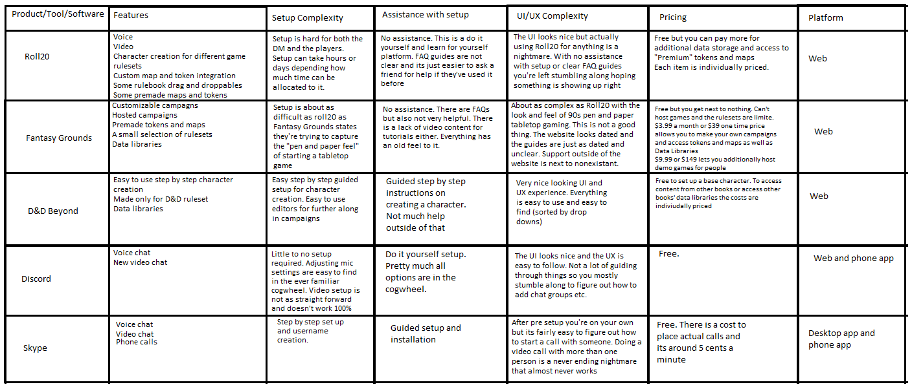
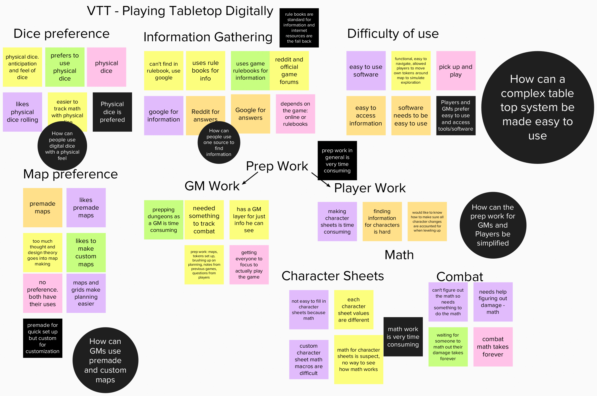

## Venture.ng Application Design

This is an in progress web application that I came up with for my General Assembly UX Design course.

The idea was to create an application for people interested in tabletop to be able to play with friends or family that are in different locations. Tabletop is a fun experience and no one should be left out just because they can't attend an in person game session. There are some tools out now that players and game masters use but often times they are pricey or very frustrating to use.

I wanted to create an application that is easy to use, easy to access and has all of the information needed for whatever ruleset is decided for the game.

## Work In Progress

This application is a work in progress and will continue to be updated as I continue through General Assembly's UX Design course. As I started this project I realized it needed to be a robust application, so even after the course is done I will continue to work on Venture.ng. I'm really excited about the project and would like to see all of the features needed are fleshed out. Feel free to check out the <a href= "https://github.com/jessicawise/venture.ng">GitHub Repo</a> to see full images of the steps completed so far

## User Research

For my user research, I conducted several in person interviews and put out a survey on a tabletop reddit.

I found that there are a lot of people already playing virtual tabletop games and are not at all adverse to not having a physical tabletop system. However, there are aspects of physical tabletop that players and game masters alike would like to have such as physical dice and game ruleset books. 

At the same time, there are problems that cross between a physical tabletop game and a virtual tabletop game that cause snags during gameplay for everyone. I found that a lot of players have a lot of trouble with calculating numbers on their character sheets and during combat. This fact causes game masters distress because it takes forever then for a player to be ready and that means lost time during a game. Players, though, are not the only ones with problems. Game masters also have to go through alot of steps to get a game ready from prepping maps and tokens to figuring out what they're going to run for a game. With many different places to find information it isn't easy for players or game masters to be 100% ready for a game.

The main problem comes down to: How can a complex tabletop system be made easy to use for both players and game masters?

### Competetive Analysis

<

## Affinity Map

## Storyboard

## Version 1 Paper Prototypes

## What I've Learned So Far

User Research is pretty interesting. Its fun to talk to people in different ways and find out how each person answers the questions. I got a lot of responses I didn't really expect and it was a nice eye opener because, I'm sure like everyone, I already had my own idea of what the application would be. It was nice to have to take a step back away from my own ideas and take in the feedback of others.

The Affinity Map step made me realize my project was going to be super robust. Because of this it is going to take me a lot longer than the 5 week General Assembly course to completely design. My plan at this point is to focus mostly on the main interface and user interaction of the gaming portion of the application. By the end of the course I plan to have a list of other features I'll be working on to make this a complete product.
